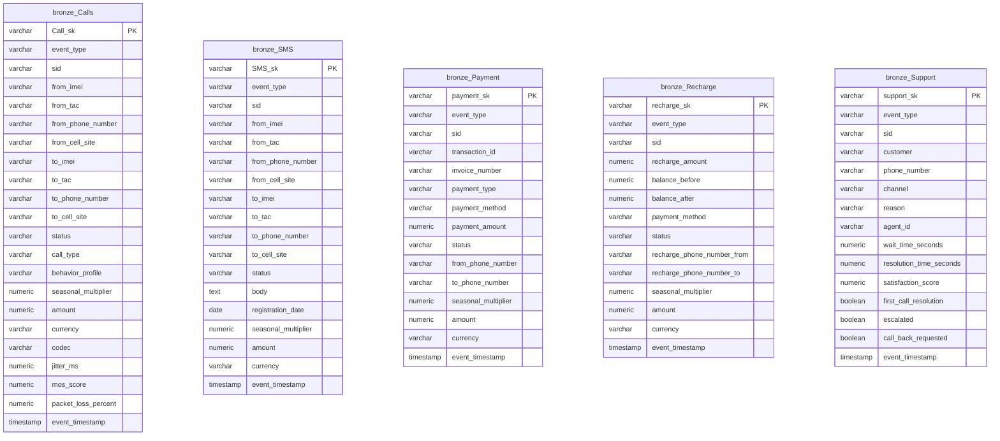
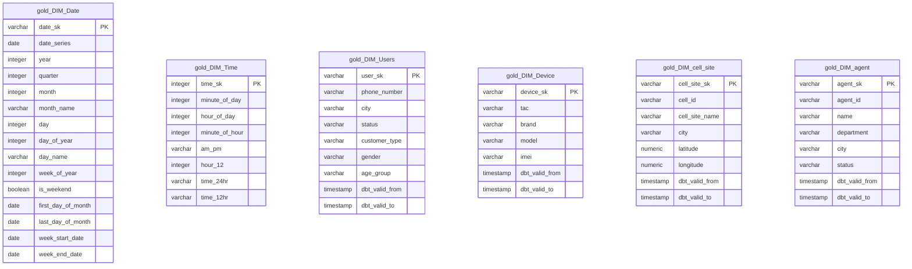

## Telecom Data Analytics Hub

An end-to-end **telecom analytics platform** that I designed and built to show how real-world telco data can be transformed into trustworthy, analytics-ready insights.  
This project brings together streaming, orchestration, warehousing, and modelling into one cohesive story—from raw events on Kafka all the way to business-ready facts and dimensions.


## 📚 Project Index

- **Project Overview**: High-level description of the use case and business context.  
- **Architecture**: End-to-end pipeline from API → Kafka → NiFi → PostgreSQL → dbt → Power BI.  
- **NiFi Flow Design**: Kafka topic ingestion, JSON validation, routing, and error handling.  
- **Data Model Schema**: Mermaid ER diagrams for Bronze and Gold layers (facts & dimensions).  
- **dbt & SQL Expertise**: Highlights of modelling, performance tuning, and best practices.  
- **Project Structure**: File/folder layout of the repository.  
- **Getting Started**: How to run Docker, initialize the database, and execute dbt.  
- **Key Features**: Main capabilities of the platform.  
- **Skills Demonstrated**: Summary of dbt, SQL, and data engineering skills.  
- **Services & Ports**: Quick reference for all running services.  
- **Data Sources**: Types of telecom events being processed.  

## 🏗️ Project Overview

This project implements a complete data pipeline for telecom analytics, processing call events, SMS, payments, recharges, and customer support interactions in a way that mirrors real telecom operations.  
The architecture follows industry best practices with a **medallion (Bronze/Silver/Gold) pattern**, showing how to incrementally clean, model, and serve data for analytics at scale.  
If you are a data engineer, analyst, or hiring manager, this repository is meant to be a **transparent, end-to-end showcase** of how I think about data quality, performance, and maintainability.

## 🛠️ Technology Stack

- **Data Orchestration**: Apache NiFi 1.21.0
- **Event Streaming**: Apache Kafka 7.5.0 with Zookeeper
- **Data Warehouse**: PostgreSQL 13
- **Data Transformation**: dbt (Data Build Tool)
- **Monitoring**: Kafka UI
- **Containerization**: Docker & Docker Compose

## 📊 Architecture

```
┌─────────────┐     ┌─────────────┐     ┌─────────────┐     ┌─────────────┐
│   NiFi      │────▶│   Kafka     │────▶│  PostgreSQL │────▶│    dbt      │
│  (Ingestion)│     │  (Streaming)│     │  (Storage)  │     │(Transform)  │
└─────────────┘     └─────────────┘     └─────────────┘     └─────────────┘
                                                                    │
                                                                    ▼
                                                          ┌─────────────┐
                                                          │ Gold Layer  │
                                                          │ (Analytics) │
                                                          └─────────────┘
```

### Data Flow
1. **Ingestion**: Apache NiFi collects and processes raw telecom events
2. **Streaming**: Kafka handles real-time event streaming
3. **Storage**: PostgreSQL stores raw and transformed data
4. **Transformation**: dbt transforms data through Bronze → Gold layers
5. **Analytics**: Gold layer provides dimensional models for business intelligence

## 🔄 NiFi Flow Design & Error Handling

- **Kafka Topic Coverage**: NiFi manages **55 Kafka topics**, with each topic handled by its own flow so that ingestion, monitoring, and replay can be controlled independently.  
- **JSON Evaluation & Cleaning**: Each flow consumes messages from its Kafka topic, evaluates the JSON payload, normalizes fields, and applies validation rules (required fields, data types, ranges, and business checks).  
- **Routing of Valid Data**: Records that pass validation are routed to `row_event` tables in PostgreSQL, one per business table (Calls, SMS, Payment, Recharge, Support, etc.), ready for downstream Bronze/dbt processing.  
- **Centralized Error Handling**: Invalid or malformed records are routed to an error path that inserts a detailed error record into a dedicated database table (including topic name, partition/offset, error reason, and timestamp).  
- **Alerting**: For flows that encounter issues, NiFi sends email notifications summarizing the failure context so problems can be investigated quickly (which topic, which flow, and what validation failed).  

## 📐 Data Model Schema

Below is the **dbt lineage graph** that connects raw `row_event` tables and CDC snapshots to dimensions and fact tables:


### Bronze Layer Schema

The Bronze layer contains cleaned and structured raw data extracted from JSON sources:



### Gold Layer - Dimension Tables

Dimension tables provide descriptive attributes for analytical queries:



### Gold Layer - Fact Tables & Star Schema

Fact tables store quantitative business events with foreign keys to dimension tables:

```mermaid
erDiagram
    gold_Fact_Call {
        varchar call_sk PK
        varchar event_type
        varchar sid
        varchar from_device_sk FK
        varchar to_device_sk FK
        varchar from_imei
        varchar to_imei
        varchar from_user_sk FK
        varchar to_user_sk FK
        varchar from_cell_site_sk FK
        varchar to_cell_site_sk FK
        varchar status
        varchar call_type
        varchar behavior_profile
        numeric seasonal_multiplier
        numeric amount
        varchar currency
        varchar codec
        numeric jitter_ms
        numeric mos_score
        numeric packet_loss_percent
        varchar date_sk FK
        integer time_sk FK
    }
    
    gold_Fact_SMS {
        varchar sms_sk PK
        varchar event_type
        varchar sid
        varchar from_device_sk FK
        varchar to_device_sk FK
        varchar from_imei
        varchar to_imei
        varchar from_user_sk FK
        varchar to_user_sk FK
        varchar from_cell_site_sk FK
        varchar to_cell_site_sk FK
        varchar status
        text body
        date registration_date
        numeric seasonal_multiplier
        numeric amount
        varchar currency
        varchar date_sk FK
        integer time_sk FK
    }
    
    gold_Fact_payment {
        varchar payment_sk PK
        varchar event_type
        varchar sid
        varchar transaction_id
        varchar invoice_number
        varchar payment_type
        numeric payment_amount
        varchar from_user_sk FK
        varchar to_user_sk FK
        varchar status
        numeric amount
        varchar currency
        numeric seasonal_multiplier
        varchar date_sk FK
        integer time_sk FK
    }
    
    gold_Fact_recharge {
        varchar recharge_sk PK
        varchar event_type
        varchar sid
        numeric recharge_amount
        numeric balance_before
        numeric balance_after
        varchar payment_method
        varchar from_user_sk FK
        varchar to_user_sk FK
        varchar recharge_phone_number_to
        varchar status
        numeric amount
        varchar currency
        numeric seasonal_multiplier
        varchar date_sk FK
        integer time_sk FK
    }
    
    gold_Fact_Support {
        varchar support_sk PK
        varchar event_type
        varchar sid
        varchar user_sk FK
        varchar customer
        varchar agent_sk FK
        varchar channel
        varchar reason
        numeric wait_time_seconds
        numeric resolution_time_seconds
        numeric satisfaction_score
        boolean first_call_resolution
        boolean escalated
        boolean call_back_requested
        varchar date_sk FK
        integer time_sk FK
    }
    
    gold_DIM_Date ||--o{ gold_Fact_Call : "date_sk"
    gold_DIM_Date ||--o{ gold_Fact_SMS : "date_sk"
    gold_DIM_Date ||--o{ gold_Fact_payment : "date_sk"
    gold_DIM_Date ||--o{ gold_Fact_recharge : "date_sk"
    gold_DIM_Date ||--o{ gold_Fact_Support : "date_sk"
    
    gold_DIM_Time ||--o{ gold_Fact_Call : "time_sk"
    gold_DIM_Time ||--o{ gold_Fact_SMS : "time_sk"
    gold_DIM_Time ||--o{ gold_Fact_payment : "time_sk"
    gold_DIM_Time ||--o{ gold_Fact_recharge : "time_sk"
    gold_DIM_Time ||--o{ gold_Fact_Support : "time_sk"
    
    gold_DIM_Users ||--o{ gold_Fact_Call : "from_user_sk"
    gold_DIM_Users ||--o{ gold_Fact_Call : "to_user_sk"
    gold_DIM_Users ||--o{ gold_Fact_SMS : "from_user_sk"
    gold_DIM_Users ||--o{ gold_Fact_SMS : "to_user_sk"
    gold_DIM_Users ||--o{ gold_Fact_payment : "from_user_sk"
    gold_DIM_Users ||--o{ gold_Fact_payment : "to_user_sk"
    gold_DIM_Users ||--o{ gold_Fact_recharge : "from_user_sk"
    gold_DIM_Users ||--o{ gold_Fact_recharge : "to_user_sk"
    gold_DIM_Users ||--o{ gold_Fact_Support : "user_sk"
    
    gold_DIM_Device ||--o{ gold_Fact_Call : "from_device_sk"
    gold_DIM_Device ||--o{ gold_Fact_Call : "to_device_sk"
    gold_DIM_Device ||--o{ gold_Fact_SMS : "from_device_sk"
    gold_DIM_Device ||--o{ gold_Fact_SMS : "to_device_sk"
    
    gold_DIM_cell_site ||--o{ gold_Fact_Call : "from_cell_site_sk"
    gold_DIM_cell_site ||--o{ gold_Fact_Call : "to_cell_site_sk"
    gold_DIM_cell_site ||--o{ gold_Fact_SMS : "from_cell_site_sk"
    gold_DIM_cell_site ||--o{ gold_Fact_SMS : "to_cell_site_sk"
    
    gold_DIM_agent ||--o{ gold_Fact_Support : "agent_sk"
```



### Schema Summary

**Bronze Layer (Schema: `bronze`)**
- **Calls**: Call event data with QoS metrics
- **SMS**: SMS transaction data
- **Payment**: Payment transaction data
- **Recharge**: Account recharge data
- **Support**: Customer support interaction data

**Gold Layer Dimensions (Schema: `gold`)**
- **DIM_Date**: Date dimension with calendar attributes
- **DIM_Time**: Time dimension (0-1439 minutes)
- **DIM_Users**: Customer dimension with SCD Type 2 support
- **DIM_Device**: Device dimension
- **DIM_cell_site**: Cell tower dimension
- **DIM_agent**: Support agent dimension

**Gold Layer Facts (Schema: `gold`)**
- **Fact_Call**: Call events with multiple dimension relationships
- **Fact_SMS**: SMS events with sender/receiver dimensions
- **Fact_payment**: Payment transactions
- **Fact_recharge**: Recharge transactions
- **Fact_Support**: Support ticket events

**Key Design Patterns:**
- ✅ Star schema with fact and dimension tables
- ✅ Surrogate keys (SK) for all dimensions and facts
- ✅ SCD Type 2 support via dbt snapshots
- ✅ Unknown/Default records (-1) for referential integrity
- ✅ Multiple foreign keys for from/to relationships
- ✅ Comprehensive indexing on foreign keys

## 🎯 dbt & SQL Expertise

This project demonstrates advanced proficiency in **dbt** and **SQL** through the following implementations:

### 1. **Medallion Architecture Implementation**

#### Bronze Layer (`models/Bronze/`)
- **Purpose**: Raw data ingestion and initial cleaning
- **Key Features**:
  - Incremental materialization with merge strategy
  - JSON parsing and extraction from nested structures
  - Data quality checks and null handling
  - Unique key generation using MD5 hashing
  - Custom indexes for performance optimization

**Example SQL Skills Demonstrated**:
```sql
-- Complex JSON extraction and transformation
from_json::jsonb ->> 'imei' as from_imei,
substr(from_json::jsonb ->> 'imei',1,8) as from_tac,
billing_info::jsonb ->> 'amount' as amount,
qos_metrics::jsonb ->> 'codec' as codec

-- Incremental logic with merge strategy

select * from Call_with_sk
where Call_sk not in (select distinct Call_sk from {{ this }})

select * from Call_with_sk

```

#### Gold Layer (`models/Gold/`)
- **Dimensional Modeling**: Star schema implementation
- **Dimensions**: Date, Time, Users, Devices, Cell Sites, Agents
- **Facts**: Call, SMS, Payment, Recharge, Support events

### 2. **Advanced SQL Techniques**

#### Date Dimension Generation
Created a comprehensive date dimension using PostgreSQL's `generate_series`:
- Year, quarter, month, day attributes
- Week calculations and weekend flags
- Fiscal period calculations
- Date range generation for full year coverage

```sql
-- Date dimension with comprehensive attributes
select
    md5(TO_CHAR(g.date_series, 'YYYY-MM-DD')) AS date_sk,
    extract(year from g.date_series) as year,
    extract(quarter from g.date_series) as quarter,
    extract(month from g.date_series) as month,
    to_char(g.date_series, 'Month') as month_name,
    case when extract(dow from g.date_series) in (0,6) 
         then true else false end as is_weekend
from generate_date_cte g
```

#### Fact Table Design
- **Surrogate Keys**: MD5-based SK generation for fact records
- **Foreign Key Relationships**: Proper joins to dimension tables
- **Multiple Dimension Links**: Support for multiple relationships (from/to users, devices, cell sites)
- **Incremental Processing**: Efficient merge strategies for large datasets

```sql
-- Complex fact table with multiple dimension joins
LEFT join {{ ref('DIM_cell_site')}} as from_cell
    on from_cell_site = from_cell.cell_id
LEFT join {{ ref('DIM_cell_site')}} as to_cell
    on to_cell_site = to_cell.cell_id
LEFT join {{ref('DIM_Users')}} as from_user
    on from_phone_number = from_user.phone_number
```

### 3. **dbt Best Practices**

#### Source Definitions (`models/source.yml`)
- Comprehensive source documentation
- Column-level descriptions
- Data lineage tracking
- Source freshness monitoring setup

#### Materialization Strategies
- **Incremental Models**: For large fact tables (Calls, Payments, etc.)
  - Merge strategy with unique keys
  - Performance optimization for large datasets
- **Table Materialization**: For dimensions requiring full refresh
- **View Materialization**: For lightweight transformations

#### Snapshots for Change Data Capture (CDC)
Implemented dbt snapshots to track historical changes:
- **Strategy**: Check strategy for detecting changes
- **Tracked Entities**: Users, Agents, Devices, Cell Sites
- **Change Detection**: Monitors specific columns for updates
- **Historical Preservation**: Maintains full change history

```sql

{{
    config(
        unique_key='phone_number',
        strategy='check',
        check_cols=['city', 'status'],
        target_schema='snapshots'
    )
}}
```

#### Configuration Management
- Schema organization (Bronze, Gold)
- Tag-based model organization
- Custom documentation with node colors
- Test configuration with failure storage

### 4. **SQL Optimization Skills**

- **Index Creation**: Strategic indexes on foreign keys and timestamp columns
- **GIN Indexes**: For JSONB columns to optimize JSON queries
- **Incremental Logic**: Efficient incremental processing to avoid full table scans
- **CTE Usage**: Clean, readable code with Common Table Expressions
- **Null Handling**: Comprehensive COALESCE and NULLIF usage
- **Data Type Conversions**: Proper casting and type handling

### 5. **Data Quality & Testing**

dbt tests are configured across the project to ensure data integrity and quality:

#### Test Configuration
- **Failure Storage**: All test failures are stored in a custom schema `_sad_test_failures` for investigation
- **Test-Driven Development**: Comprehensive testing at dimension and fact table levels

#### Generic Tests Implemented

**Uniqueness & Primary Keys**
```sql
- not_null: Ensures surrogate keys and business keys are always populated
- unique: Validates that surrogate keys (agent_sk, device_sk, user_sk, etc.) are unique
```

**Referential Integrity**
```sql
- relationships: Validates foreign key constraints
  Examples:
  - from_device_sk → DIM_Device.device_sk
  - from_user_sk → DIM_Users.user_sk
  - from_cell_site_sk → DIM_cell_site.cell_site_sk
  - date_sk → DIM_Date.date_sk
  - time_sk → DIM_Time.time_sk
```

#### Test Coverage by Layer

**Dimensions Testing**
- ✅ Agent dimension: Surrogate key uniqueness, natural key validation
- ✅ Cell Site dimension: Location data validation, coordinate not-null checks
- ✅ Device dimension: IMEI, TAC, brand/model validation
- ✅ Users dimension: Phone number, demographic attributes validation
- ✅ Time dimension: Time key uniqueness and bounds validation
- ✅ Date dimension: Calendar attributes integrity

**Fact Tables Testing**
- ✅ Fact_Call: Call keys, device/user relationships, QoS metrics validation
- ✅ Fact_SMS: SMS keys, sender/receiver relationships validation
- ✅ Fact_payment: Transaction keys, amount/currency validation
- ✅ Fact_recharge: Recharge amount, balance validation
- ✅ Fact_Support: Support ticket relationships, timestamp validation

#### Test Execution
```bash
# Run all tests
dbt test

# Run tests for specific model
dbt test -s <model_name>

# Run with failure inspection
dbt test --store-failures  # Tests stored in _sad_test_failures schema
```

#### Data Validation Features
- Null checks on critical business attributes
- Surrogate key uniqueness across all dimensions and facts
- Foreign key relationship validation across star schema
- Automatic test failure documentation for troubleshooting

## 📁 Project Structure

```
Telecom Data Analytics Hub/
├── docker-compose.yml          # Infrastructure orchestration
├── create_tables.sql           # Database schema setup
├── telecom_model/              # dbt project
│   ├── dbt_project.yml         # dbt configuration
│   ├── models/
│   │   ├── Bronze/             # Raw data layer
│   │   │   ├── Calls.sql
│   │   │   ├── SMS.sql
│   │   │   ├── Payment.sql
│   │   │   ├── Recharge.sql
│   │   │   ├── Support.sql
│   │   │   └── ...
│   │   ├── Gold/
│   │   │   ├── dimensions/     # Dimension tables
│   │   │   │   ├── DIM_Date.SQL
│   │   │   │   ├── DIM_Time.SQL
│   │   │   │   ├── DIM_Users.SQL
│   │   │   │   └── ...
│   │   │   └── Facts/          # Fact tables
│   │   │       ├── Fact_Call.SQL
│   │   │       ├── Fact_SMS.SQL
│   │   │       └── ...
│   │   └── source.yml          # Source definitions
│   └── snapshots/              # CDC snapshots
│       ├── CDC_Users.sql
│       ├── CDC_Agent.sql
│       └── ...
├── source/                     # Data generation scripts
└── nifi-drivers/              # NiFi JDBC drivers
```

## 🚀 Getting Started

### Prerequisites
- Docker & Docker Compose
- dbt-core with dbt-postgres adapter
- Python 3.x (for data generation)

### Setup Instructions

1. **Start Infrastructure**
   ```bash
   docker-compose up -d
   ```

2. **Initialize Database**
   ```bash
   psql -h localhost -U postgres -d telecom -f create_tables.sql
   ```

3. **Configure dbt**
   Create `~/.dbt/profiles.yml`:
   ```yaml
   telecom_model:
     outputs:
       dev:
         type: postgres
         host: localhost
         user: postgres
         password: 8122
         port: 5432
         dbname: telecom
         schema: public
     target: dev
   ```

4. **Run dbt Models**
   ```bash
   cd telecom_model
   dbt run
   dbt test
   dbt docs generate
   dbt docs serve
   ```

## 📈 Key Features

### Data Processing Capabilities
- **Real-time Event Processing**: Kafka-based streaming architecture
- **Batch Processing**: dbt transformations for analytical workloads
- **Change Data Capture**: Historical tracking via dbt snapshots
- **Incremental Updates**: Efficient processing of large datasets

### Data Quality & Testing
- **Automated dbt Tests**: Extensive `not_null`, `unique`, `relationships`, and custom tests on both Bronze and Gold models to validate data before it is used for analytics.  
- **Quality Monitoring**: All test failures are stored and reviewed, turning data quality issues into actionable feedback to improve the pipeline.

### Analytics Ready
- **Star Schema**: Optimized for analytical queries
- **Time-based Analysis**: Comprehensive date and time dimensions
- **Multi-dimensional Facts**: Support for complex analytical scenarios
- **Data Lineage**: Full documentation of data transformations

## 🎓 Skills Demonstrated

### dbt Expertise
✅ Medallion architecture (Bronze/Gold)  
✅ Incremental materialization strategies  
✅ Snapshot implementation for CDC  
✅ Source definitions and documentation  
✅ Model organization and tagging  
✅ Configuration management  
✅ dbt project structure best practices  
✅ Generic tests (not_null, unique, relationships)  
✅ Test failure storage and investigation  
✅ Data quality enforcement across layers  

### SQL Expertise
✅ Complex JSON parsing and extraction  
✅ Window functions and CTEs  
✅ Date/time manipulation  
✅ Surrogate key generation  
✅ Dimensional modeling (star schema)  
✅ Incremental merge logic  
✅ Performance optimization (indexes, GIN indexes)  
✅ Data quality and validation  
✅ Multi-table joins and relationships  

### Data Engineering
✅ ETL/ELT pipeline design  
✅ Real-time and batch processing  
✅ Data warehouse design  
✅ Change data capture  
✅ Data quality implementation  

## 🔧 Services & Ports

| Service | Port | Description |
|---------|------|-------------|
| NiFi | 8080, 8443 | Data orchestration UI |
| Kafka | 9092, 29092 | Event streaming |
| Kafka UI | 8090 | Kafka monitoring |
| PostgreSQL | 5432 | Database |
| Zookeeper | 2181 | Kafka coordination |

## 📝 Data Sources

The project processes the following telecom event types:
- **Call Events**: Voice call records with QoS metrics
- **SMS Events**: Text message transactions
- **Payment Events**: Billing and payment transactions
- **Recharge Events**: Prepaid account top-ups
- **Support Events**: Customer service interactions

## 🤝 Contributing

This is a portfolio project demonstrating data engineering and analytics capabilities. For questions or feedback, please reach out.

## 📄 License

This project is for portfolio and demonstration purposes.

---

**Built with expertise in dbt, SQL, NIFI and modern data engineering practices.**

